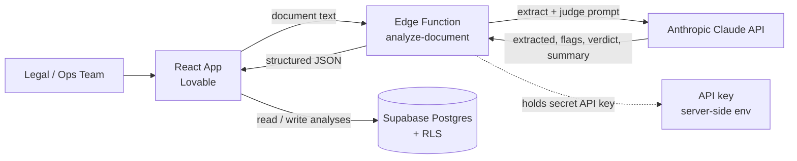

# AI Document Compliance Checker for Real Estate

A tool that reviews Indian real estate agreements for compliance gaps and risks —
extracting key terms, flagging issues against a compliance rubric, and producing a
due-diligence summary for human review. Built to attack the document- and
compliance-heavy corner of real estate where deals stall and risk hides.

**Live demo:** https://property-doc-check.lovable.app

## The problem
Real estate in India is governed by heavy documentation and compliance — RERA,
stamping and registration, KYC, deposit norms. Reviewing agreements for gaps is
slow, manual, and dependent on scarce legal attention, so risks slip through and
transactions stall. The value isn't in replacing a lawyer — it's in surfacing what
a human should check, fast.

## What it does
- **Extract** — pulls the key terms out of an agreement (parties, consideration,
  deposit, term, notable clauses) from messy document text.
- **Judge** — evaluates the document against a real estate compliance rubric (RERA
  reference, stamping/registration, KYC, deposit norms, notice/termination,
  penalties, red flags) and flags each as OK / Attention / Missing.
- **Summarize** — produces a plain-language due-diligence summary and an overall
  verdict, explicitly framed as an automated review, not legal advice.

## Architecture

- **Frontend:** React (built with Lovable) — document input, results, and history.
- **Database:** Supabase (Postgres) — an `analyses` table with row-level security.
- **AI layer:** a server-side edge function calls the Anthropic Claude API with a
  structured extract-then-judge compliance rubric and returns JSON.
- **Security:** the LLM API key is held server-side in the function's environment
  and never exposed to the client.

## Key design decisions
- **Extract-then-judge in a single pass** — the model first pulls structured facts
  from unstructured legal text, then reasons about them against a compliance rubric.
- **Matched the model to the task** — this uses a stronger model (Claude Sonnet)
  than my lead-scoring project (Claude Haiku), because legal document analysis is
  materially harder than simple classification. Right-sizing the model to the
  difficulty is a deliberate cost-and-quality trade-off.
- **Human-in-the-loop by design** — the tool flags issues for review and never
  gives legal advice or declares a document "compliant." A tool that pretends to
  replace a lawyer is both unsafe and unsellable; framing it as decision-support is
  what makes it responsible and usable.
- **Sized the token budget to the output** — a larger response (extracted fields,
  a full flag list, a summary) needs a larger token limit so the JSON never
  truncates mid-response.

## Production hardening (what I'd do next)
- Replace pasted text with document upload and OCR (PDFs, scanned agreements).
- Move the database write inside the edge function (service-role) so results can't
  be tampered with client-side.
- Deepen the rubric with state-specific rules (e.g. Maharashtra registration and
  stamp-duty specifics, applicable deposit caps) — the differentiator this is built
  to grow into.
- Add authentication and per-firm data isolation via RLS.
